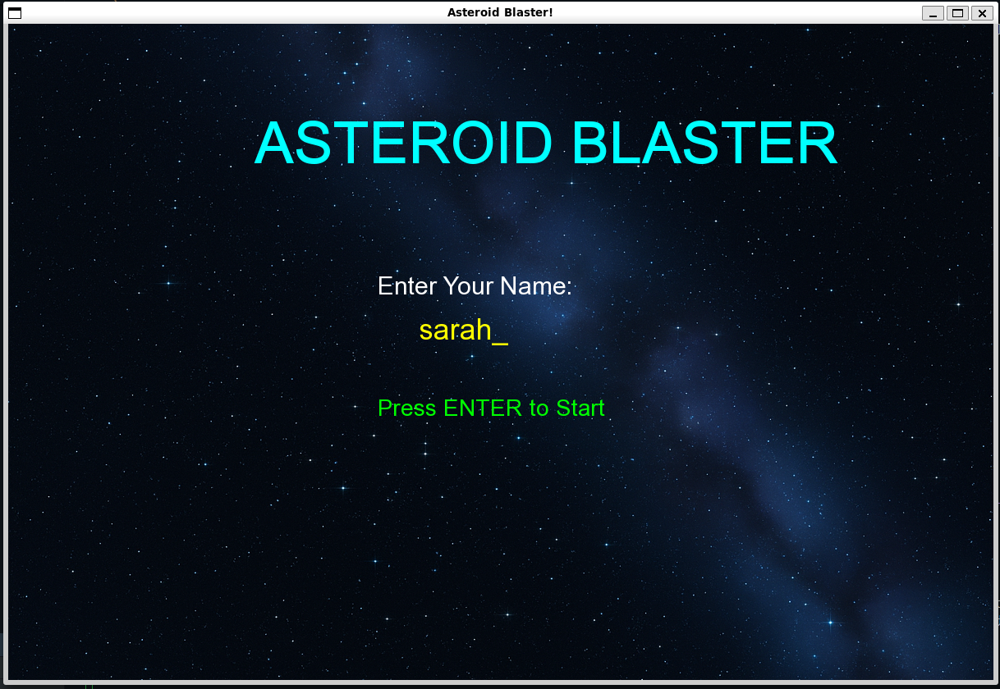
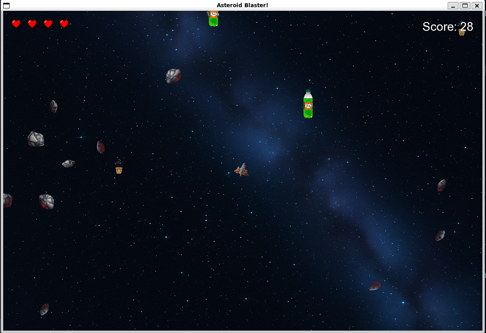
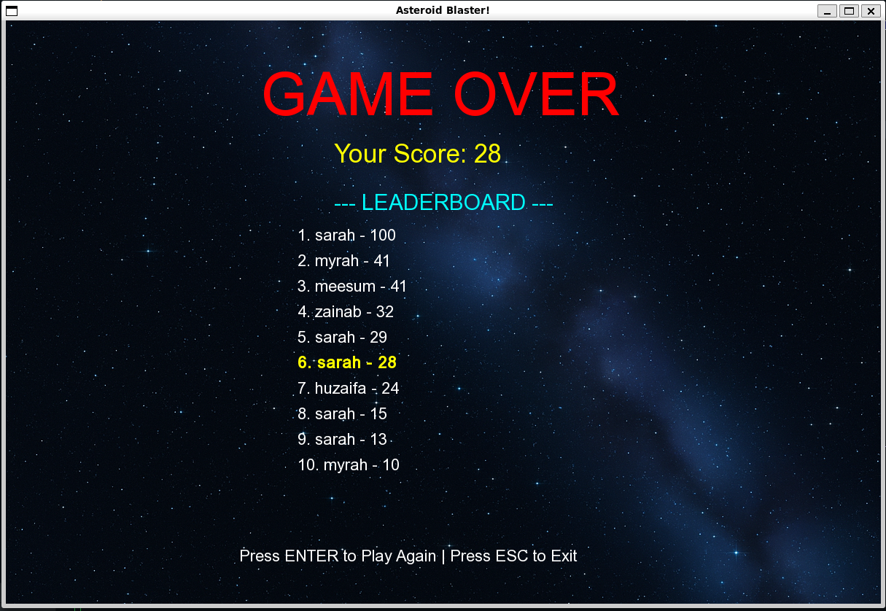

# 🚀 Asteroid Blaster

A classic space shooter game built with C++ and SFML where you navigate through space, destroy asteroids, collect power-ups, and survive as long as possible!






## Table of Contents
- [Features](#features)
- [Prerequisites](#prerequisites)
- [Installation](#installation)
- [How to Play](#how-to-play)
- [Power-Ups](#power-ups)
- [Game Mechanics](#game-mechanics)
- [Project Structure](#project-structure)
- [Compilation](#compilation)
- [Controls](#controls)
- [Credits](#credits)

##  Features

- **Classic Arcade Gameplay**: Navigate your spaceship through an asteroid field
- **Power-Up System**: Collect three unique power-ups with special abilities
- **Lives System**: Start with 5 lives displayed as hearts
- **Score Tracking**: Earn points for every asteroid destroyed
- **Leaderboard**: Save your high scores and compete with previous attempts
- **Main Menu**: Enter your name before starting the game
- **Game Over Screen**: View your final score and the top 10 leaderboard
- **Dynamic Difficulty**: Asteroids continuously spawn and split when destroyed
- **Shield System**: Temporary invincibility with visual indicator
- **Smooth Animations**: Explosions, thrust effects, and sprite animations

##  Prerequisites

Before running the game, ensure you have:

- **C++ Compiler**: MinGW-w64 (GCC 7.3.0 or higher)
- **SFML 2.5.0**: Simple and Fast Multimedia Library
- **Operating System**: Windows (tested), Linux/Mac (compatible with adjustments)

##  How to Play

### Starting the Game

1. Run the executable: `./main`
2. Enter your name on the main menu
3. Press **ENTER** to start the game

### Objective

- Destroy as many asteroids as possible
- Avoid collisions with asteroids
- Collect power-ups to gain advantages
- Survive and achieve the highest score!

### Game Over

- When you lose all 5 lives, the game ends
- Your score is automatically saved to the leaderboard
- View the top 10 high scores
- Press **ENTER** to play again or **ESC** to exit

##  Power-Ups

The game features three Pakistani-themed power-ups that spawn randomly:

| Power-Up | Icon | Effect | Duration |
|----------|------|--------|----------|
| **Chai** ☕ | `chai.png` | Speed Boost - Move faster! | 5 seconds |
| **Pakola** 🥤 | `pakola.png` | Extra Life - Gain +1 life | Instant |
| **Paratha** 🥞 | `paratha.png` | Shield - Temporary invincibility | 6 seconds |

*Maximum 5 power-ups can be on screen at once*

##  Game Mechanics

### Asteroids
- **Large Asteroids**: 25 radius, worth 1 point
- **Small Asteroids**: 15 radius, created when large asteroids are destroyed
- **Movement**: Random speeds and directions
- **Spawning**: Continuous spawn from screen edges

### Player
- **Lives**: Start with 5 hearts
- **Speed**: Adjustable with thrust control
- **Shooting**: Unlimited bullets with fire rate limit
- **Collision**: Lose 1 life when hit (unless shielded)

### Scoring
- +1 point for each asteroid destroyed
- Scores saved with player name in `scores.txt`
- Leaderboard displays top 10 scores

##  Project Structure

### Core Classes

- **Entity**: Base class for all game objects
- **Player**: Player spaceship with weapon and power-up systems
- **Asteroid**: Asteroid objects with random movement
- **Bullet**: Projectile fired by the player
- **PowerUp**: Collectible items with special effects
- **Animation**: Handles sprite animations
- **GameStateManager**: Manages menu, gameplay, and game over screens

### Key Files

- `main.cpp`: Main game loop and logic
- `Globals.h/cpp`: Global constants (screen size, conversion factors)
- `GameState.h/cpp`: Menu and leaderboard management
- `scores.txt`: Persistent score storage (auto-generated)

##  Compilation

### Windows (MinGW)

```bash
g++ main.cpp src\Animation.cpp src\Entity.cpp src\Player.cpp src\Asteroid.cpp src\Bullet.cpp src\Globals.cpp src\PowerUp.cpp src\GameState.cpp -I include -I "C:\SFML-2.5.0\include" -L "C:\SFML-2.5.0\lib" -lsfml-graphics -lsfml-window -lsfml-system -o main
```


### Run the Game

```bash
./main
```

## 🎮 Controls

| Key | Action |
|-----|--------|
| **Arrow Keys** | |
| ← Left Arrow | Rotate spaceship left |
| → Right Arrow | Rotate spaceship right |
| ↑ Up Arrow | Thrust forward |
| **Spacebar** | Shoot bullets |
| **Enter** | Start game / Restart |
| **ESC** | Quit game |

##  Object-Oriented Design

The game demonstrates key OOP principles:

- **Inheritance**: Entity → Player, Asteroid, Bullet, PowerUp
- **Polymorphism**: Virtual `update()` and `draw()` methods
- **Encapsulation**: Private members with public interfaces
- **Composition**: GameStateManager uses multiple game objects
- **Dynamic Memory**: Smart pointer usage for entity management

##  Future Enhancements

- [ ] Sound effects and background music
- [ ] Multiple weapon types
- [ ] Boss battles
- [ ] Difficulty levels
- [ ] Multiplayer support
- [ ] Better explosion effects
- [ ] Combo system for consecutive hits

##  Credits

**Developed by**: Sarah, Zainab ,Huzaifa

**Technologies Used**:
- C++
- SFML 2.5.0 (Simple and Fast Multimedia Library)


##  License

This project is created for educational purposes as part of an OOP course project.


*Destroy asteroids, collect power-ups, and dominate the leaderboard!*